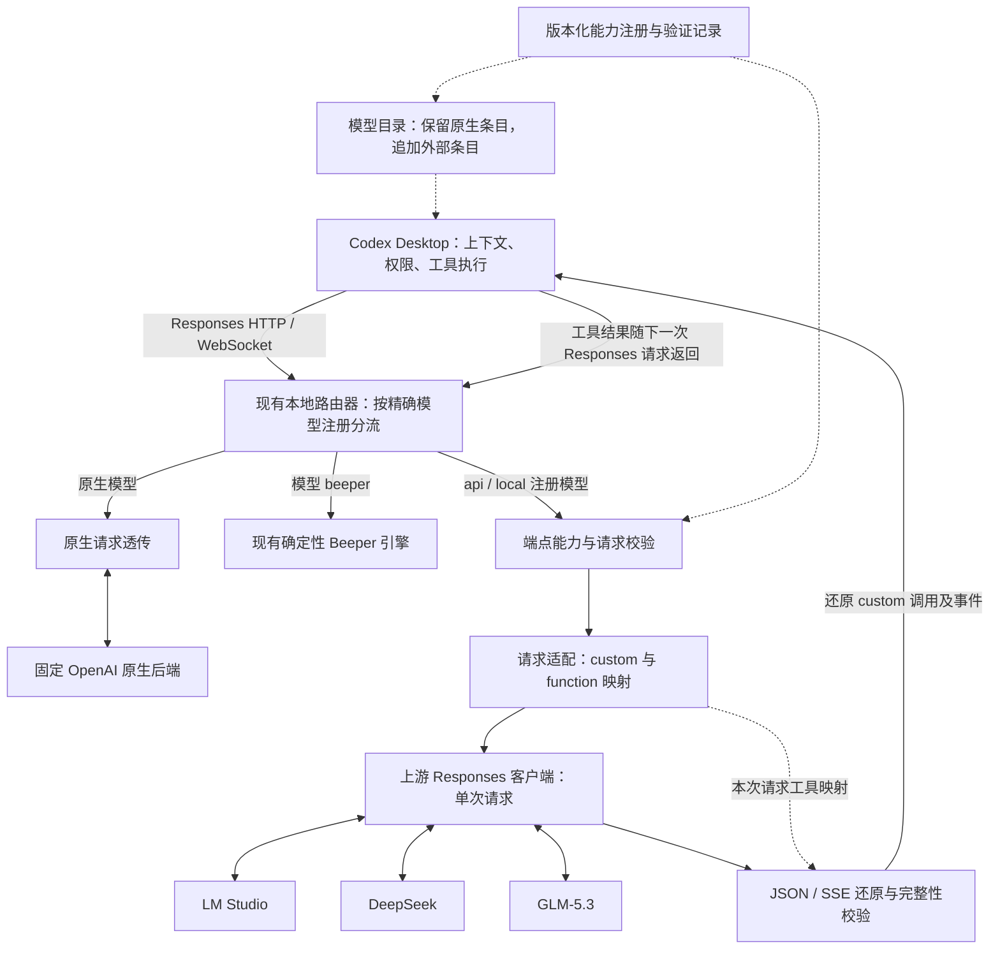

# Responses 工具兼容：开发计划与架构

2026-09-09 所有者决定：暂停新的 Desktop 搜索桥接开发，仅保留
[设计思路](retained-desktop-search-idea.md)。未经明确要求不得删除或自动恢复开发。
本文件中的搜索扩展内容均为待重新评估的设计，已有映射和诊断修复保留。

2026-09-09 后续决定：按所有者“开始研发”要求恢复普通工具协议适配，参考
[CC Switch 的请求工具上下文及还原实现](https://github.com/farion1231/cc-switch/blob/f3b18df12007d0fd79fd8ad8d310880664015197/src-tauri/src/proxy/providers/transform_codex_chat.rs)。
本轮增加显式 `additional_tools_v1` 输入声明转换，统一处理顶层声明、Lite 输入声明、
已加载工具、历史调用和具名结果；不会据此恢复被暂停的托管搜索替换方案。
实现契约、Codex 0.153.4 版本依据和隔离测试范围见
[输入工具声明](model-router.md#input-tool-declarations-alpha117)。

当前设计核对（2026-09-09，alpha.122 源码）：工具声明映射与调用还原已有实现；
托管 `web_search` 到 Desktop 搜索工具的绑定尚未实现。下列早期验收记录保留为
历史证据，不代表当前源码、运行中服务或搜索能力已经通过新的 Desktop 验收。

alpha.120 补齐完整 JSON 转事件流的大小边界：首个事件前按实际序号检查单事件
16 MiB 和累计 64 MiB，包含重复快照和元数据；超限不释放先前工具、不裁剪或重试。
另修复长文本误用 2 MiB 工具参数限制。源码回归与 HTTP/WS 隔离验证见
[事件大小契约](model-router.md#generated-event-bounds-alpha120)；运行中路由器尚未部署此改动。

alpha.121 支持推理项的可空 content，按当前 CLI Schema 区分缺失、null 和空数组；
共享校验同时覆盖显式历史与完成输出，拒绝异常结构和未完成项，保持成功终态之前
不释放工具。原始类型、文字和元数据保持原样；见[推理项契约](model-router.md#reasoning-content-validation-alpha121)。

历史进度（alpha.97–104，2026-09-06）：alpha.104 准备具名函数结果的显式文本表示；既有核心适配、注册预检和隔离评测保留。
alpha.103 已完成一轮真实 Desktop 读写和 3 项现有测试，实际保留正常审批；中途工具格式与结果检查错误仍保留。
本机已完成真实 CLI + LM Studio + exec + 嵌套 MCP 的完整往返；三家上游均有基础实测。
该阶段 T5 存在模型质量限制，T6 的跨任务转发、其他真实 Desktop 检查与全局部署尚未完成；仅存在受控试验入口。
这些历史结果不代表 alpha.122 的当前验收状态；当前工作归属见下方表格。
本计划落实 2026-09-06 的范围决定：兼容 LM Studio、DeepSeek、GLM-5.3 的
Responses 接口；不开发 Chat Completions 转换或 LiteLLM 接入。

## 目标与边界

让 Codex Desktop 保持工具执行、上下文和权限的所有权，通过 Responses 路由器
使用已验证的外部模型。兼容层负责工具协议表达，不执行代码，不调用 Desktop 任务
工具，不生成业务答案，不参与 Final Callback，不另建 agent 执行循环。

按“准确端点 + 模型 + 能力”选择适配方式。原生 OpenAI 通路继续保持原始请求字节
与现有认证路由；固定 Beeper 的本地确定性 provider 保持独立协议。外部请求在发送前
确定透传、函数包装或拒绝，不在 400、超时或流中断后换协议、换模型或自动重试。

旧 registry v1 保留原有行为；新的兼容功能通过版本化注册格式显式启用。当前
model-router.md 已同步区分透传与显式适配契约；安装和真实 Desktop 接入分别验收。

## 统一工具声明 mapping：现状与搜索扩展边界

现有 [responses_tool_adapter.py](../scripts/operator_core/responses_tool_adapter.py)
用 `ToolSpec` 保存原始类型、名称、namespace、定义、上游别名和包装格式，
`RequestContext` 绑定本次请求的映射、可见工具、历史 call_id 与 tool_choice。
这已经是统一声明与还原层，不需要再建一套与现有映射并行的执行协议。

| Desktop 当前声明 | 模型侧表达 | 返回 Desktop 的调用 | 当前状态 |
|---|---|---|---|
| 普通 `function`，包括以函数形式暴露的 MCP 工具 | function；namespace 使用确定性别名 | 原始 name/namespace 的 `function_call` | 已实现协议映射 |
| 已注册的 `custom`，例如 `exec` | 按端点能力保留 custom 或包装成 `{input: string}` 函数 | `custom_tool_call`，原样保留 input | 已实现；未知 grammar 拒绝 |
| `namespace` 工具组 | 编译其成员，保存各自来源 | 恢复成员原始类型和 namespace | 已实现；别名冲突拒绝 |
| 客户端 `tool_search` | 包装成函数 | `tool_search_call`，`execution: client` | 已实现工具发现；不是网页搜索 |
| `additional_tools` 输入声明 | 显式开启 `additional_tools_v1` 后编译为顶层工具 | 按原始类型与 namespace 还原 | alpha.117；仅接受已核对的 developer 声明，原始封套保留在请求内 |
| 完成输出检查 | 显式 `completed_output_policy=require_message_or_tool` | 只有已验证的调用或非空回复/拒绝文本才满足条件 | alpha.119；默认保持原行为，不把 reasoning 文本提升为回复或调用 |
| `tool_search_output` 返回的已加载工具 | 成功结果进入同一个请求映射 | 按加载工具的原始身份还原 | 已实现；未完成或失败的结果拒绝，未加载工具不能自行获得调用权限 |
| 托管 `web_search` / `web_search_preview` | 不转发 | HTTP 400，`unsupported_tool_type` | 搜索绑定尚未实现 |
| 上游执行的 `mcp` 声明或其他未知类型 | 不转发 | HTTP 400，`unsupported_tool_type` | 不等同于 Desktop 已声明的 MCP 函数 |

表中的“已实现”描述源码协议路径，不是任意模型、MCP 服务或 Desktop 版本的验收。
源码中的别名只供上游使用，不注册新的 Desktop 工具。`codex.search` 之类名称可以
作为设计示意，不能替代当前工具真实身份；实际函数别名必须符合端点允许的字符和长度。
call_id 保留自真实调用，缺失时拒绝，不为使历史配对成功而补造身份。
原始参数 schema 保留给上游和 Desktop；当前适配器检查声明形状、JSON 对象和特定
包装契约，不宣称实现了完整 JSON Schema 校验或所有 grammar 的受约束解码。

### 搜索绑定是新增能力，不是通用改名

暂停保留的搜索扩展方案优先复用当前 Desktop 任务已允许调用的搜索工具，由 Desktop 执行并
返回真实结果。配置在 LM Studio 的服务端 MCP 属于另一种执行通道，不由本方案隐式启用。
一个函数恰好叫 `web_search`，或机器安装过搜索 MCP，均不足以建立托管搜索映射。

在允许转换之前，设计和验收必须明确以下契约：

1. 按准确端点、模型与版本化能力配置选择绑定，指定精确的目标工具身份和参数 schema；
   不通过厂商名、工具名关键词、工具描述或助手文本猜测执行端。
2. 目标须由当前请求实际声明并允许调用。延迟工具须先经 Desktop 正常发现/加载；
   只有 `exec` 网关可见时，适配器不能据此声称已经知道内部搜索工具。网关桥接需要
   单独的显式契约，在 Desktop 执行时验证准确工具身份，不能凭引用对话生成调用代码。
3. 明确托管工具设置与目标参数的对应关系，包括域名限制、位置和搜索模式等被使用的
   字段；无法保留的约束在发送前拒绝。`none`、指定工具、并行限制和取消语义不能放宽。
   原始托管工具和替代执行工具的身份都要可追溯，不能伪称为原始工具类型的无损往返。
4. 定义结果和错误表示，保留来源 URL、内容边界、顺序及真实调用关联。不把 MCP 结果
   冒充原生托管搜索事件或引用元数据，不把搜索失败或权限拒绝转成模型编写的成功结果。
5. 独立验证缺失绑定、重复/歧义目标、schema 不符、未加载、权限拒绝、取消与失败不重试，
   再验证真实 Desktop 搜索往返。模拟通过不能替代实际审批和搜索结果证据。

在这些契约实现前，即便请求同时带有名称类似的搜索函数，托管 `web_search` 仍应
返回 `unsupported_tool_type`，不得悄悄删除后继续。原生模型与原生搜索辅助端点保持
现有透传；注册搜索工具、部署适配器和真实 Desktop 验收分别记录。

## 架构

图中 A、E 仅用于显式启用适配的外部注册项；无需适配的外部 Responses 保留原有
透传方式。原生工具辅助端点继续走现有专用原生通路。全局入口切换仍是单独的部署
步骤，不能由注册、探测、安装或测试隐式触发。

## 模块与接口设计

| 模块 | 职责 | 依赖限制 |
|---|---|---|
| model_registry.py（现有） | 兼容读取 v1；验证新注册格式；生成符合能力的外部目录项 | 不从原生模板继承未经验证的模型功能 |
| responses_capabilities.py（已实现） | 描述普通函数、custom 名称范围、tool_choice、模态、推理档位与状态式历史支持 | 按显式配置工作；未知能力不自动视为支持 |
| responses_tool_adapter.py（已实现） | 编译本次工具映射；转换定义、历史调用、结果与非流式响应 | 纯数据变换；不访问网络、磁盘、Desktop 或执行器 |
| responses_events.py（已实现） | 增量解析 SSE；重建受影响事件；验证完成、失败与截断 | HTTP 和 WebSocket 共用状态机；有明确内存边界 |
| model_router.py（现有） | 把适配器接入外部 HTTP/WS 路径；保留原生通路 | 不导入业务队列、Final Callback 或 task-control |
| operator_model_router.py / model_router_config.py（现有） | 显式注册能力；只读显示状态；调用独立探测入口 | 探测不自动加载业务历史、不自动启用全局入口 |

适配器的概念接口为 `prepare_request -> (payload, request_context)`，
`restore_response(response, request_context)` 和 `restore_events(events, request_context)`。
request_context 保存原始工具类型、名称、别名、允许的输入格式及调用对应关系，
仅驻留内存。下一轮从 Desktop 提交的 tools/input 重建映射，不持久化模型历史。

## 协议决定

### custom exec 包装与还原

不支持原生 custom 的端点，把已声明的 custom 工具包装成具有字符串 `input`
参数的普通 function。保留原始描述和格式说明；函数别名具有确定性，名称冲突拒绝。
响应使用本次映射还原为 `custom_tool_call`；后续的 `custom_tool_call_output`
转换成相应 function 结果。普通 function 和上游已验证支持的 custom 可保持原样。

工具名、call_id、顺序和 input 字符串必须往返一致。中文、emoji、引号、反斜线、
CRLF/LF、Unicode 分隔符均进入保真测试。只改变协议包装，不修写、截短或执行代码。
缺少 input、input 非字符串、未知工具、重复/矛盾 call_id 均明确失败。

初始 tools、历史调用、tool_search 输出中已加载的工具和 namespace 需要采用同一
映射。第一条 exec 原型可只覆盖单个 custom，但不能在其余必要工具尚未支持时标记
为完整 Desktop 兼容。不支持的工具类型不得悄悄从请求中删除。

### tool_choice 与 grammar

保留 auto、none、required、指定工具的原始约束。若上游不支持对象形式的指定工具，
仅在已验证支持 required 时，允许预先选择“仅暴露指定工具 + required”的明确映射；
否则发送前拒绝。HTTP 200 却未满足强制调用条件视为协议失败，不自动改为 auto 再发。

原始 grammar 保存在描述里不等于服务端受约束解码。T1 明确首批支持的格式；对当前
exec 接受的封装语法做返回前校验，对未知语法明确拒绝。语法校验与上游生成能力分别
报告，不宣称等价。不能通过自动改写生成代码来通过校验。

### JSON、SSE 与 WebSocket

普通文本可继续流式传递。被包装的代码工具先有界收集参数，取得完整 JSON、字符串
input 和成功终态后，才提交可执行的完整 custom 调用。同步还原 added/delta/done、
output_item 和最终 response.output；必要时为适配后的事件统一生成单调 sequence_number。
不同工具的 id、output_index 与结果不能串线，不能把 JSON 转义碎片直接当代码输出。

上游 response.failed / incomplete、缺失成功终态、畸形事件、参数超限、断流或取消
均结束当前尝试，不伪造 response.completed。下游断开时取消本次上游连接；取消不是
回滚或未执行证明。保持现有不重放约束，不承诺网络场景 exactly-once。

HTTP 与现有 WebSocket→Responses SSE 通路使用同一转换核心。响应被改写时同步
处理 Content-Length/Content-Encoding 等头部，避免沿用原始字节长度。

### 模型能力、推理和历史

能力注册包括：准确模型、端点、上下文、模态、推理参数及有效档位、custom 名称
允许范围、工具选择方式、previous_response_id 支持和协议版本。现有推理枚举需
支持官方声明中的 max；不要把 none/low/medium/high/xhigh/max 视为各模型通用档位。

developer 角色、reasoning 项、工具结果中的图片/结构化内容必须有明确支持范围。
不丢弃内容来制造成功；角色映射须单独定义和验证。加密上下文/compaction 保持拒绝，
不解析、不去除后重发。首批外部验证使用新上下文和显式输入历史；不在兼容层增加
previous_response_id 的历史缓存来模拟上游能力。

模型目录仅声明该注册项真实支持的能力，原生条目保持完整。供应商自带目录是配置
依据，不是任意 exec 或 Desktop 执行成功的证据。实际 code-mode 工具呈现需独立验证。

## 验收工作归属（2026-09-09）

早期 T0–T6 是开发阶段编号，不再作为一份额外的日常回归待办。当前统一按以下入口执行：

| 旧计划或方向 | 当前处理 | 维护入口 |
|---|---|---|
| T0–T4：环境、协议、映射、事件与路由集成 | 已有实现进入现有源码测试；按改动选择模块，跨层改动和发布前执行全量 | [回归维护](../tests/README.md)与[发布审计](release-audit.md) |
| T5a / T5b：LM Studio、DeepSeek、GLM-5.3 | 按准确端点、模型、能力和版本保留实测记录；历史失败不消失，旧证据不自动代表新版本 | [注册与验收](responses-acceptance.md) |
| T6：真实 Desktop 与部署准备 | 独立核对真实 Desktop 门槛、目录/工具呈现、原生辅助通路及生命周期；未完成项保持待验收 | [注册与验收](responses-acceptance.md)和[路由部署契约](model-router.md) |
| Desktop 搜索替换 | 暂停；不加入当前实现或验收队列，保留设计，须所有者明确恢复 | [保留思路](retained-desktop-search-idea.md) |

原 T0 的 216 项基线（213 通过、3 跳过）属于历史记录，未启动业务服务；当前数量和
结果以发布审计为准。真实模型探测、真实 Desktop 验收与全局部署各有独立条件，不能
因为整理测试而合并证据或标记完成。在线凭据不可用时继续其余工作，不虚构密钥、
读取无关凭据或在失败后自动切换模型。T6 全局激活仍需已有真实验收条件和明确部署授权。

每个实现阶段同步源码、安装清单、测试、架构与升级文档；需要更新项目规则时保持
根 AGENTS 与插件镜像逐字节一致。通过项目脚本安装，不能手改 runtime/cache。
本计划不新增 MCP、Hook 或业务回调接口。

## 验证执行范围

源码测试的选择与覆盖归属统一维护在[回归维护](../tests/README.md)，本文不再复制
一套场景清单。上述协议约束和[路由契约](model-router.md)继续定义预期行为；
真实模型及 Desktop 的证据规则由[注册与验收](responses-acceptance.md)维护。

隔离测试必须在本机精确 Operator 停止、pending/captured 回调均为零时运行，使用
临时状态与假上游。真实模型探测与隔离测试分开；不能把官方声明或模拟测试当作
已接入 Desktop，更不能当作飞书端到端回传证据。

## 实测结果（2026-09-06）

alpha.97 首轮隔离回归共运行 266 项，无失败，3 项因目录快照未提供或 Windows
符号链接权限而跳过。当前 CLI 的两项 exec 用例已实际运行，未被跳过。发布审计通过：
79 个清单文件，Python/PowerShell 语法通过，规则镜像字节一致；MCP 与 Hook 接口未变。
测试在精确 Operator 停止且 pending/captured 回调为零时运行。

以下都是有界合成输入探测，不执行上游生成的代码。每例只发送一次；只有原样返回
指定源代码，才发送一次模拟结果供模型读取。失败记录保留，未自动换协议、重发或换模型。
候选能力配置包含待验证项，不能直接当作生产能力声明。

| 上游与验证配置 | 基础调用及结果回传 | required | 字符和长输入边界 |
|---|---|---|---|
| DeepSeek `deepseek-v4-flash`，官方 Responses，`none` | JSON、SSE 通过，14 字节源代码和校验值均精确一致 | `none` 通过；早期 `low` 返回 400 | 中文/emoji/转义保留，但 CRLF 变 LF；4818 字节长源被改成 4868 字节，探测失败 |
| GLM `glm-5.3-flash`，智谱 Responses，`low` | JSON、SSE 通过，基础源代码和校验值精确一致 | 已通过基础探测 | CRLF 变 LF；4818 字节长源被缩成 4368 字节，探测失败 |
| LM Studio 0.4.15，现有 `qwen3.6-27b-neo-code-here-2t-ot` | SSE 通过；校验文本去除首尾空白后匹配 | HTTP 200 未调用工具，被适配器拒绝 | 4818 字节长源的 JSON 往返通过；CRLF 变 LF 的字符探测失败 |

早期 DeepSeek 探测还出现未成功终态/输出上限，以及返回了与格式元数据等长的输入。
调整包装描述，明确区分“格式说明”和“实际工具输入”后，基础 JSON/SSE/required 才通过。
这属于新协议描述的独立验证，不是对已接受或不确定业务请求的重试。
适配器从上游实际生成的 input 到 Desktop 逐字符保留；模型没有照抄用户源代码是另一个
质量问题，适配器不能通过删注释、换行转换或修补代码制造探测成功。

当前 Desktop CLI 0.153.4 在临时 home 和假上游中真正执行了 `text(17 + 25);`，并将
`42` 回传给下一轮。嵌套图片工具的能力拒绝也完整回传；成功的嵌套文件操作尚未验收，
独立诊断遭到 Windows 访问拒绝。隔离测试保留只读沙箱和 Codex 权限检查。

CLI 即使看到目录的 `supports_search_tool=false` 仍可能默认附带 `web_search`。
本次隔离测试显式设置 `web_search="disabled"`；外部适配器继续拒绝未知内置工具。
因此 T6 尚需真实 Desktop 的工具呈现、成功嵌套工具、原生辅助工具及全局入口生命周期
验收。代码未安装到当前生产 runtime，未修改全局配置、在线路由或任务默认值。

## alpha.98 优化与追加验收

继续优化时定位并修复了两个真实接入问题。LM Studio 接收 Codex 的文本分块工具结果时
返回 400；显式 `text_tool_outputs="json_string"` 将完整分块列表序列化后，模型成功读取
模拟结果。内容、顺序、分块边界和元数据均保留，图片或未知类型不会被降为文本。
当前 CLI 还会在串行能力目录下发送 `parallel_tool_calls=true`；它表示允许并行，
不要求并行。适配器现在按上游能力预先收紧为 false，并继续拒绝违反单调用限制的响应。

新增 `tool_choice_by_reasoning` 可按推理档位明确允许 auto/none/required/named，
缺少对应配置或组合不支持时，在 HTTP/WS 发送前拒绝；不改变推理档位、不降低 required，
不在失败后补发。旧 v2 配置省略新增字段时保留原行为。

SSE 行扫描保留增量位置，避免收到每个小块都重新扫描长缓冲区。同机合成基准中，
4 MiB 单事件按 128 字节分块从 1.9769 秒降为 0.0334 秒；1 MiB 从 0.1169 秒降为
0.0064 秒。这是本机解析性能对比，不是端到端模型速度承诺。多字节字符、混合换行、
长记录、短行密集输入以及成功终态的保真测试继续通过。

| 追加验证 | 结果 |
|---|---|
| 真实 CLI + 假上游 + 嵌套 MCP 算术工具 | 执行及结果回传通过，保留只读沙箱与权限检查 |
| LM Studio 原生文本分块结果 | 第二次请求 400，保留失败记录 |
| LM Studio 显式 JSON 字符串结果适配 | 两次请求通过；模拟校验值去除首尾空白后匹配 |
| 真实 CLI + LM Studio + exec + 嵌套 MCP | 两次模型请求，约 22.8 秒；MCP 返回的随机校验值最终精确匹配，无重试 |
| LM Studio 指定工具名 | 首次请求 400；保持 named=reject，未增加隐式降级 |
| LM Studio 显式 JSON 表示的 Unicode 源代码 | 模型仍改动源字符串；未修补代码或把该例判为通过 |

真实 CLI + LM Studio 验证使用一次性临时 home、合成 MCP、独立请求次数上限和单次
尝试记录；本地连接无 API 密钥，不创建持久业务任务、不接触飞书或现有任务历史。
修复前的首次串行兼容诊断在发送上游前被拒绝，记录保留；修复并通过隔离 CLI 回归后，
才进行独立的新版验证。此次未重新调用 DeepSeek/GLM 在线 API。

完整回归运行 273 项，无失败，3 项环境跳过；其中当前 CLI 的四项测试均实际运行。
发布审计通过，79 个清单文件、安装清单、规则镜像、Python/PowerShell 语法同步。
仍需真实 Desktop 界面的目录与默认模型、原生辅助工具和长期生命周期验收；未升级当前
生产 runtime，未启用全局入口。长源逐字复写和强制调用仍按实测能力约束处理。

## alpha.99 能力配置与多轮验收

新增私有能力 profile，绑定端点、模型、推理档位、能力声明和适配源码摘要，并记录
日期、CLI 版本与各用例结果。配置变化或源码变化不继承旧的“已验证”标记；失败记录
保留。`preflight` 可直接检查实际合成请求，不调用上游；`profile-build` 只读取精确匹配
的私有评测记录；注册命令保留追加行为，并在写入时独占保留已确认空闲的监听端口。

当前 CLI 0.153.4 下，DeepSeek `deepseek-v4-flash/none`、GLM `glm-5.3-flash/low`
和现有 LM Studio 模型分别完成了嵌套调用、多轮挑战值回传、工具 isError 后恢复、
读取文件后提出最小补丁并核对完整内容，以及收到上游头后取消连接，15 个最终用例通过。
每项分别最多 2/3/3/4/1 次模型请求，不重试。私有配置仅声明此次验证所需的保守能力，
没有增加高推理档位、图片、搜索或强制调用的支持声明。

补丁计划在内存中验证，确认原临时文件未写入；实际写入工具被 CLI 审批策略拒绝时，
保留该结果，不伪装只读、不降低审批。此次发现并修复测试 MCP 的 Windows stdio 编码
问题，显式 UTF-8 后，两个在线端点的补丁任务通过，异常的 11–31 秒工具等待消失。
原失败样本作为测试程序缺陷保留，不计为模型质量失败。

`status` 增加固定阶段与次数统计，`readiness` 只读检查部署条件，`restart` 在入口停用且
没有执行中请求时显式重启服务。指标区分头部、首字节、响应内容读取、适配 CPU、客户端间隔
和测试工具耗时；首字节不等于模型首 token，不将重叠时长相加。生产配置与默认模型未变。

完整命令、结果表与尚需人工完成的 Desktop 验收见
[Responses 注册与验收](responses-acceptance.md)。

最终全量回归 287 项，无失败；2 项因本机创建符号链接权限不足而跳过。
当前 CLI 的目录、执行与多轮用例均实际运行。发布审计通过 86 个清单文件，规则镜像、
安装清单及 Python/PowerShell 语法同步。生产 Operator/router 保持停止，开放 callback 为 0。

## 参考与已知限制

- [CC Switch custom 工具包装源码](https://github.com/farion1231/cc-switch/blob/db34612807244643d85ccedf9704c965facc4cba/src-tauri/src/proxy/providers/transform_codex_chat.rs#L141-L168)：借鉴映射思路，本项目不引入其 Chat 协议路径。
- [CC Switch exec 事件测试](https://github.com/farion1231/cc-switch/blob/db34612807244643d85ccedf9704c965facc4cba/src-tauri/src/proxy/providers/streaming_codex_chat.rs#L1293-L1320)：验证事件转换，并非当前 JavaScript exec 的实际执行证明。
- [DeepSeek Responses 文档](https://api-docs.deepseek.com/guides/responses_api/)：截至调研时，custom 仅允许 apply_patch；exec 需单独处理。
- [Z.AI Codex 接入](https://docs.z.ai/devpack/tool/codex)：专用 Responses 端点与官方模型目录；任意 custom exec 尚需实测。
- [LM Studio Responses 文档](https://lmstudio.ai/docs/developer/openai-compat/responses)：本机 0.4.15 已跑通 JSON、SSE、普通函数往返，但 custom 被拒绝，required 曾无调用，none 仍产生推理内容。

外部模型适配通过后，模型本身是否可靠地遵循 exec 的工具使用要求仍是独立质量问题。
本阶段不扩展到完整 Responses 资源 API、外部 compaction、跨提供方加密上下文或
Windows 登录自启；这些能力各自需要单独实现和验收。
